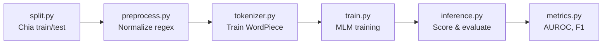

# Kế hoạch chạy huấn luyện LAnoBERT

## Tổng quan dự án

**LAnoBERT** là hệ thống phát hiện bất thường (anomaly detection) trong system log, dựa trên mô hình BERT với Masked Language Modeling (MLM). Ý tưởng chính:

1. Huấn luyện BERT từ đầu (from-scratch) trên **chỉ log bình thường** với objective MLM
2. Khi inference, mask từng từ trong log → nếu model "bất ngờ" (cross-entropy cao) → log đó là anomaly

### Kiến trúc code



| Module | File | Chức năng |
|--------|------|-----------|
| Config | [`utils.py`](file:///Users/ruby/dev/LAnoBERT/lanobert/utils.py) | Load YAML config, seed, device |
| Split | [`split.py`](file:///Users/ruby/dev/LAnoBERT/lanobert/split.py) | Chia log thành train (normal only) + test theo thời gian |
| Preprocess | [`preprocess.py`](file:///Users/ruby/dev/LAnoBERT/lanobert/preprocess.py) | Regex normalize: mask IP, block ID, numbers → placeholders |
| Tokenizer | [`tokenizer.py`](file:///Users/ruby/dev/LAnoBERT/lanobert/tokenizer.py) | Train WordPiece tokenizer riêng cho log |
| Dataset | [`dataset.py`](file:///Users/ruby/dev/LAnoBERT/lanobert/dataset.py) | `LogLineDataset`: mỗi dòng log = 1 sample, pre-tokenize toàn bộ |
| Train | [`train.py`](file:///Users/ruby/dev/LAnoBERT/lanobert/train.py) | HuggingFace `Trainer` + `BertForMaskedLM` from scratch |
| Inference | [`inference.py`](file:///Users/ruby/dev/LAnoBERT/lanobert/inference.py) | Mask-each-word scoring + dedup caching + top-k sweep |
| Metrics | [`metrics.py`](file:///Users/ruby/dev/LAnoBERT/lanobert/metrics.py) | AUROC, best-F1, ROC curve |

### 3 Dataset được hỗ trợ

| Dataset | Split method | Vocab size | Kích thước raw |
|---------|-------------|------------|----------------|
| **BGL** | line (80/20 chronological) | 1,000 | ~700MB |
| **HDFS** | block (group by `blk_id`) | 200 | ~1.5GB |
| **Thunderbird** | line (80/20 chronological) | 10,000 | ~30GB |

---

## User Review Required

> [!IMPORTANT]
> **Chọn dataset để bắt đầu:** Bạn muốn huấn luyện trên dataset nào?
> - **BGL** (khuyến nghị — vừa phải, nhanh nhất, kết quả AUROC = 1.000)
> - **HDFS** (vừa, cần thêm file `anomaly_label.csv`)
> - **Thunderbird** (rất lớn ~30GB, mất nhiều thời gian download + train)
>
> Hoặc bạn muốn chạy cả 3?

> [!WARNING]
> **Máy Mac không có NVIDIA GPU** — training sẽ chạy trên CPU (hoặc MPS nếu Apple Silicon). Code mặc định dùng `bf16=True` khi có CUDA, trên CPU sẽ tự tắt. Training trên CPU sẽ **chậm hơn đáng kể** (có thể vài giờ cho BGL thay vì ~30 phút trên GPU).
>
> **Bạn có muốn giảm số epochs hoặc giới hạn data để test nhanh trước không?** Ví dụ: giảm `num_train_epochs: 10` → `1-2` epochs để verify pipeline chạy đúng trước.

> [!IMPORTANT]
> **MPS (Apple Silicon) support:** Hiện tại [`utils.py`](file:///Users/ruby/dev/LAnoBERT/lanobert/utils.py#L55-L62) chỉ check `cuda`. Nếu bạn dùng Mac M-series, tôi có thể thêm MPS support để tận dụng GPU Apple Silicon, giúp nhanh hơn đáng kể so với CPU.

---

## Kế hoạch thực hiện (5 bước)

### Bước 1: Cài đặt dependencies

```bash
pip install -r requirements.txt
```

Dependencies chính: `torch>=2.0`, `transformers>=4.48`, `tokenizers>=0.20`, `accelerate>=0.26`, `datasets>=2.14`, `scikit-learn`, `numpy`, `pandas`, `tqdm`, `PyYAML`, `matplotlib`, `tensorboard`

---

### Bước 2: Download data

```bash
# Chọn 1 hoặc nhiều dataset:
bash scripts/download_data.sh bgl       # → data/BGL/BGL.log (~700MB)
bash scripts/download_data.sh hdfs      # → data/HDFS/HDFS.log + anomaly_label.csv (~1.5GB)
bash scripts/download_data.sh tbird     # → data/Thunderbird/Thunderbird.log (~30GB)
```

Script download từ **Zenodo (loghub)** qua `wget`/`curl`, rồi giải nén.

---

### Bước 3: Chạy pipeline (1 lệnh hoặc step-by-step)

#### Option A — Một lệnh chạy toàn bộ:

```bash
bash scripts/run_pipeline.sh configs/bgl.yaml
```

Script tự động chạy 5 bước và skip bước đã hoàn thành.

#### Option B — Chạy từng bước (kiểm soát hơn):

```bash
# [1/5] Split: chia train/test theo thời gian
python -m lanobert.split --config configs/bgl.yaml

# [2/5] Preprocess: normalize log bằng regex
python -m lanobert.preprocess --config configs/bgl.yaml --split train
python -m lanobert.preprocess --config configs/bgl.yaml --split test

# [3/5] Tokenizer: train WordPiece vocab riêng
python -m lanobert.tokenizer --config configs/bgl.yaml

# [4/5] Train: MLM pretraining BERT from scratch
python -m lanobert.train --config configs/bgl.yaml

# [5/5] Inference + Evaluate: score test set → AUROC/F1
python -m lanobert.inference --config configs/bgl.yaml
```

---

### Chi tiết từng bước

#### Split ([`split.py`](file:///Users/ruby/dev/LAnoBERT/lanobert/split.py))
- **BGL/Thunderbird:** Lấy 80% đầu tiên theo thứ tự thời gian làm train region, 20% còn lại làm test. Train = chỉ normal lines trong train region. Test = normal lines ở test region + **tất cả** anomaly lines từ toàn bộ stream.
- **HDFS:** Group theo `blk_id`, label từ `anomaly_label.csv`. Normal blocks chia 80/20, test = remaining normal + tất cả anomaly blocks.
- Output: `*_train_normal.raw`, `*_test.raw`, `*_test_label.log`

#### Preprocess ([`preprocess.py`](file:///Users/ruby/dev/LAnoBERT/lanobert/preprocess.py))
- Regex-based normalization riêng cho từng dataset (BGL, HDFS, Thunderbird profiles)
- Mask: IP → `IP`, block_id → `BLK`, numbers → `NUM`, datetime → `TIME`, paths → `PATH`, etc.
- Output: `*_parsed.log` (mỗi dòng = 1 log đã normalize)

#### Tokenizer ([`tokenizer.py`](file:///Users/ruby/dev/LAnoBERT/lanobert/tokenizer.py))
- Train `BertWordPieceTokenizer` từ `tokenizers` library
- Vocab nhỏ: BGL=1000, HDFS=200, Thunderbird=10000
- Special tokens: `[PAD]`, `[UNK]`, `[CLS]`, `[SEP]`, `[MASK]`

#### Train ([`train.py`](file:///Users/ruby/dev/LAnoBERT/lanobert/train.py))
- Model: `BertForMaskedLM` random-init, BERT-base architecture (12 layers, 768 hidden, 12 heads), nhưng với **vocab nhỏ riêng**
- Training: HuggingFace `Trainer`, MLM probability 20%, cosine LR schedule
- Hyperparams: batch=32, lr=1e-4, 10 epochs, warmup 10%, weight_decay 0.01
- 1% data held-out cho validation, chọn best model theo `eval_loss`
- Output: `outputs/<dataset>/model/final/`

#### Inference ([`inference.py`](file:///Users/ruby/dev/LAnoBERT/lanobert/inference.py))
- **Word-level masking:** Với mỗi từ trong log, thay bằng `[MASK]`, forward pass BERT
- Đo 2 signals: cross-entropy loss (error) và max predictive prob
- **Dedup caching:** Log lặp lại nhiều → chỉ score unique lines (tiết kiệm ~60-90%)
- **Sliding window:** Log dài hơn `max_len` được chia window, đảm bảo mọi từ được score
- Aggregate: `error_mean` (khuyến nghị), top-k sweep
- Output: `outputs/<dataset>/results/` (scores `.npy`, ROC `.png`, report `.txt`)

---

### Bước 4: Kiểm tra kết quả

Kết quả mong đợi (AUROC / best-F1):
| Dataset | `error_mean` |
|---------|-------------|
| BGL | 1.000 / 1.000 |
| HDFS | 0.997 / 0.969 |
| Thunderbird | 1.000 / 1.000 |

Files output:
```
outputs/<dataset>/
├── model/final/           # Trained model + tokenizer
├── results/
│   ├── scores_error_mean.npy
│   ├── <dataset>_error_mean_report.txt
│   ├── <dataset>_error_mean_roc.png
│   └── ...
└── tokenizer/             # WordPiece vocab
```

---

### Bước 5 (tuỳ chọn): Chạy ablation experiments

Configs sẵn trong [`configs/ablations/`](file:///Users/ruby/dev/LAnoBERT/configs/ablations):
- `*_bertbase_init.yaml` — BERT-base architecture, random-init, bert-base vocab
- `*_bertbase_tapt.yaml` — BERT-base pretrained weights, fine-tune MLM trên log
- `*_pretrained.yaml` — BERT-base off-the-shelf (không train)

```bash
bash scripts/run_pipeline.sh configs/ablations/bgl_bertbase_tapt.yaml
```

---

## Open Questions

1. **Dataset nào chạy trước?** BGL được khuyến nghị vì nhỏ nhất và nhanh nhất.
2. **Bạn có NVIDIA GPU không?** Nếu chỉ có CPU/MPS, nên giảm epochs hoặc limit data ban đầu.
3. **Bạn muốn tôi thêm MPS (Apple Silicon) support** vào code không? Hiện tại code chỉ check CUDA.
4. **Bạn đã cài Python environment chưa?** (venv/conda) — tôi có thể giúp setup.

## Verification Plan

### Automated Tests
```bash
# Verify pipeline chạy end-to-end (có thể giảm epochs cho nhanh):
bash scripts/run_pipeline.sh configs/bgl.yaml

# Check output exists:
ls outputs/BGL/results/*_report.txt
cat outputs/BGL/results/BGL_error_mean_report.txt
```

### Manual Verification
- Kiểm tra AUROC trong report file ≈ kết quả mong đợi
- Xem ROC curve trong `*_roc.png`
- So sánh với pretrained checkpoint từ HuggingFace Hub
