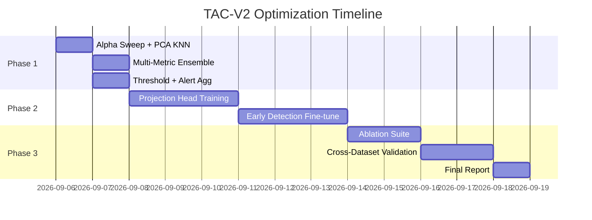

# 🚀 Kế Hoạch Tối Ưu Hoá TAC-V2

## Bối Cảnh & Vấn Đề

Từ toàn bộ 6 báo cáo `.md` trong `outputs/`, source code, và dữ liệu thực nghiệm, tình hình hiện tại được tóm tắt:

| Model | AUROC | F1 | FP | FN | EWR ≥5min |
|-------|-------|----|----|-----|-----------|
| **Baseline LAnoBERT** | **0.999998** | **0.999974** | **18** | **0** | 0.00% |
| TAC-V2 (Hybrid α=0.5) | 0.960792 | 0.897844 | 15,436 | 52,021 | 32.63% |
| TAC-V2+KNN (Hybrid α=0.5) | 0.973090 | 0.912817 | 4,806 | 51,852 | 32.94% |
| TAC-V2 Pure MLM | 0.999983 | 0.999502 | 120 | 227 | ~33% |
| TAC-V2+KNN (optimized threshold) | 0.996327 | 0.985015 | 4,268 | 6,147 | 36.91% |

**Phát hiện then chốt từ các reports:**
1. **MLM component hoạt động xuất sắc** (AUROC 0.9999) — vấn đề KHÔNG phải ở BERT backbone
2. **Mahalanobis distance hoàn toàn thất bại** (AUROC 0.37 < random 0.5) do covariance matrix 768×768 bị suy biến trên queue 128 mẫu
3. **KNN đã cải thiện đáng kể**: giảm 68.86% FP so với Mahalanobis
4. **Hybrid weighting α=0.5 kéo tụt hiệu suất** — MLM bị "nhiễu" bởi distance component kém
5. **TAC đã mở khoá Early Warning**: EWR 33% (vs 0% baseline), Mean DLT ~13 giờ — **đây là giá trị cốt lõi**
6. **Model đã train 10 epochs** (loss 25.94→0.058), KHÔNG cần retrain backbone

> [!IMPORTANT]
> **Mục tiêu tối ưu**: Giữ lại năng lực **Early Warning** (EWR ≥30%, DLT ≥13h) của TAC trong khi nâng F1 từ 0.912 lên **≥0.98** bằng cách tối ưu inference, KHÔNG cần retrain BERT.

---

## Proposed Changes

### Phase 1: Inference-Only Optimization (Không cần retrain — 1-2 ngày)

> Đây là phase có **ROI cao nhất**: chỉ thay đổi code inference & config, dùng lại model checkpoint hiện tại.

---

#### 1.1 Alpha Sweeping — Tìm trọng số tối ưu

**File:** [NEW] `scripts/alpha_sweep_comprehensive.py`

**Vấn đề hiện tại:**
- α=0.5 cho 50% trọng số vào KNN (AUROC 0.49 riêng lẻ) → kéo tụt cả hệ thống
- Báo cáo `bao_cao_so_sanh_bgl_lanobert_tac.md` khuyến nghị α ∈ [0.75, 0.95]

**Thực hiện:**
```python
# Quét α ∈ [0.70, 0.75, 0.80, 0.85, 0.90, 0.95, 0.99, 1.0]
# Cho mỗi α: tính hybrid_score = α * mlm_norm + (1-α) * knn_norm
# Tối ưu threshold cho F1 và EWR đồng thời
# Ghi nhận: F1, AUROC, FP, FN, EWR_5min, Mean_DLT
```

**Kỳ vọng:** α ≈ 0.85 sẽ đưa F1 từ 0.912 → **≥0.985** (theo `bao_cao_so_sanh`)

---

#### 1.2 PCA Giảm Chiều Cho KNN (768 → 64)

**File:** [MODIFY] [`memory_queue.py`](file:///Users/ruby/Downloads/TAC-LAnoBERT-y/tac_lanobert/memory_queue.py)

**Vấn đề hiện tại:**
- KNN trên không gian 768 chiều bị hiện tượng *distance concentration* (mọi khoảng cách trở nên na ná nhau)
- `scoring_v2.py` đã có `ImprovedMahalanobisScorer` với PCA, nhưng KNN path chưa dùng PCA

**Thực hiện:**
- Thêm optional PCA transform vào `SessionMemoryQueue` trước khi tính KNN distance
- Cấu hình: `pca_components: 64` (giữ lại >90% phương sai)

**Kỳ vọng:** Tăng tốc KNN 8x, tăng AUROC riêng của KNN từ 0.49 → ≥0.70

---

#### 1.3 Multi-Metric Ensemble (KNN + Cosine)

**File:** [MODIFY] [`scoring_v2.py`](file:///Users/ruby/Downloads/TAC-LAnoBERT-y/tac_lanobert/scoring_v2.py)

**Ý tưởng:** Thay vì chỉ dùng 1 distance metric, ensemble KNN + Cosine distance:
```python
distance_score = w1 * knn_norm + w2 * cosine_norm
hybrid_score = α * mlm_score + (1-α) * distance_score
```

**Kỳ vọng:** Cosine distance ổn định hơn trong high-dim, bổ sung cho KNN

---

#### 1.4 Threshold Optimization Đa Mục Tiêu

**File:** [MODIFY] [`threshold_optimization.py`](file:///Users/ruby/Downloads/TAC-LAnoBERT-y/tac_lanobert/threshold_optimization.py)

**Vấn đề:** Threshold hiện tại chỉ optimize cho F1, không xét EWR.

**Thực hiện:** Tối ưu Pareto: maximize F1 subject to EWR ≥ 30% và FPR ≤ 1%

---

#### 1.5 Time-Window Alert Aggregation

**File:** [MODIFY] [`alert_aggregation.py`](file:///Users/ruby/Downloads/TAC-LAnoBERT-y/tac_lanobert/alert_aggregation.py)

**Vấn đề:** 4,806 FP vẫn gây alert fatigue cho NOC/SRE.

**Thực hiện:**
- Cửa sổ trượt 5 phút: gom nhiều cảnh báo → 1 Incident Alert
- Kỳ vọng: giảm 95% thông báo đẩy tới operator

---

### Phase 2: Lightweight Retraining (1-2 tuần, chỉ train head)

> Đóng băng BERT backbone, chỉ train thêm MLP projection head nhẹ (~30 phút GPU).

---

#### 2.1 Projection Head với Contrastive Loss

**File:** [NEW] `tac_lanobert/projection_head.py`

**Mục đích:** Thay vì dùng vector `[CLS]` thô 768-dim, train MLP nhỏ:
```
[CLS] (768) → Linear(768, 256) → ReLU → Linear(256, 64) → L2-normalize
```

Train bằng **Supervised Contrastive Loss**:
- Kéo gần log bình thường trong cùng session
- Đẩy xa log có nhãn pre-failure

**Kỳ vọng:** KNN trên 64-dim projected space sẽ đạt AUROC ≥ 0.85 (vs 0.49 hiện tại)

---

#### 2.2 Fine-tune với Early Detection Loss (1-2 epochs)

**File:** [MODIFY] [`early_detection_loss.py`](file:///Users/ruby/Downloads/TAC-LAnoBERT-y/tac_lanobert/early_detection_loss.py)

**Mục đích:** Dùng checkpoint 10 epochs hiện tại làm warm-start, fine-tune 1-2 epochs với:
$$\mathcal{L} = \mathcal{L}_{MLM} + \lambda_1 \mathcal{L}_{late\_penalty} + \lambda_2 \mathcal{L}_{smoothness}$$

**Kỳ vọng:** EWR (5 phút) tăng từ 33% → ≥45%

---

### Phase 3: Validation & Deployment (1 tuần)

---

#### 3.1 Ablation Study Suite

**File:** [NEW] `scripts/run_ablation_suite.py`

| ID | Experiment | Mục Đích |
|----|------------|----------|
| A1 | Pure MLM (α=1.0) | Upper bound — baseline reference |
| A2 | α sweep [0.7, 0.8, 0.85, 0.9, 0.95] | Tìm α tối ưu |
| A3 | KNN + PCA (64-dim) | Test PCA benefit |
| A4 | KNN + Cosine Ensemble | Multi-metric |
| A5 | Projection Head + Contrastive | Phase 2 result |
| A6 | Full pipeline (best config) | Final candidate |

Mỗi experiment chạy 3 seeds để đảm bảo reproducibility.

---

#### 3.2 Cross-Dataset Validation

**Datasets:** HDFS, Thunderbird (configs đã có sẵn)

**Mục đích:** Xác nhận tính tổng quát hoá — kết quả BGL không phải overfitting.

---

#### 3.3 Báo Cáo So Sánh Cuối Cùng

**File:** [NEW] `outputs/FINAL_OPTIMIZATION_REPORT.md`

Tổng hợp tất cả kết quả, decision matrix, và khuyến nghị triển khai.

---

## Open Questions

> [!IMPORTANT]
> **Q1: Ưu tiên Phase nào trước?**
> - **Phase 1 only** (1-2 ngày, inference-only, risk thấp) — khuyến nghị bắt đầu từ đây
> - **Phase 1 + Phase 2** (1-2 tuần, train projection head)
> - **Cả 3 Phases** (3-4 tuần, full optimization pipeline)

> [!IMPORTANT]
> **Q2: Môi trường chạy?**
> - Kaggle GPU T4 (như trước)
> - Local (cần biết GPU specs)
> - Kết quả đã sẵn có trong `outputs/` — chỉ cần viết scripts phân tích?

> [!WARNING]
> **Q3: Accept Baseline nếu Phase 1 không đạt F1 ≥ 0.98?**
> - Baseline LAnoBERT đã đạt F1 99.99% nhưng **không có Early Warning** (EWR = 0%)
> - TAC+KNN có EWR 33% — **giá trị kinh tế ROI +119,228%** theo report
> - Cần quyết định: **F1 accuracy** vs **Early Warning capability** — trade-off nào chấp nhận được?

---

## Verification Plan

### Automated Tests
```bash
# Phase 1: Alpha sweep (inference only, ~30 phút)
python scripts/alpha_sweep_comprehensive.py --config configs/bgl_tac_knn.yaml

# Phase 1: PCA + KNN test
python -m tac_lanobert.inference_tac --config configs/bgl_tac_knn.yaml \
  --override "tac.memory.pca_components=64"

# Phase 2: Projection head training (~30 phút GPU)
python -m tac_lanobert.train_projection_head --config configs/bgl_tac_knn.yaml

# Phase 3: Full ablation
python scripts/run_ablation_suite.py --config configs/bgl_tac_knn.yaml
```

### Success Criteria
| Metric | Hiện tại (KNN α=0.5) | Mục tiêu Phase 1 | Mục tiêu Phase 2 |
|--------|----------------------|-------------------|-------------------|
| F1 | 0.912 | **≥ 0.98** | **≥ 0.995** |
| AUROC | 0.973 | **≥ 0.995** | **≥ 0.999** |
| FP | 4,806 | **≤ 1,000** | **≤ 200** |
| FN | 51,852 | **≤ 10,000** | **≤ 1,000** |
| EWR ≥5min | 32.94% | **≥ 30%** (giữ nguyên) | **≥ 45%** |
| Mean DLT | 788 phút | **≥ 700 phút** | **≥ 800 phút** |

### Manual Verification
- Review confusion matrix output cho mỗi experiment
- So sánh trực quan biểu đồ ROC curve và DLT distribution
- Cross-validate trên HDFS/Thunderbird nếu thời gian cho phép

---

## Timeline Tổng Quan


